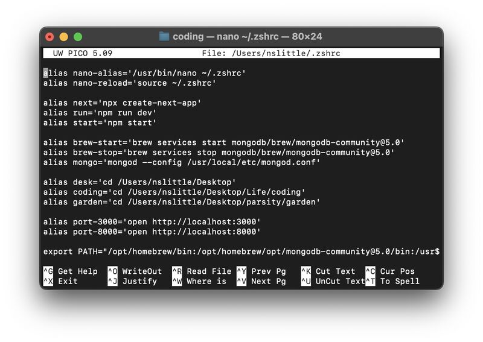

# Help Guides

## Create Alias

1. Open Terminal

2. Type: nano ~/.zshrc

3. Create aliases to your liking using the format alias name='command'

4. See examples of aliases 

5. Type: Ctr + X + Enter 5 (to exit)

6. Type: Y + Enter (to save)

7. Type: source ~/.zshrc (to reload)